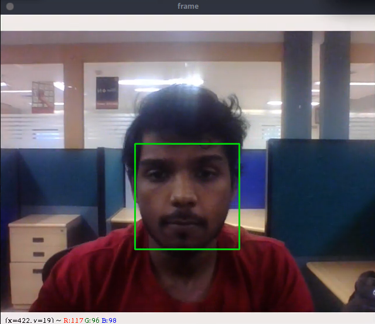
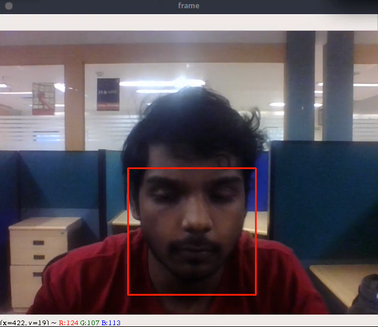

# open-eye-detector
A simple opencv script to detect if the eyes are open or closed

### Introduction
A resnet inspired CNN model to predict if a person's eye is open or closed.

The main use case for this, is while in face recognition we have to ensure the person remains active and not asleep while doing the auth process, so we have trained the model to ouput closed eyes and some-what drowsy eyes.

**Eye opened -- Green** 
 
**Eye closed-- Red**





### Contents
1. [Installation](#installation)
2. [Demo](#demo)

### Installation

**Requirements**
  1) Keras
  2) Tensoflow
  3) OpenCV
  4) dlib
  
  just run,
  ```
  pip3 install -r requirements.txt
  ```
  to instal the dependencies.
  
### Demo
If you've cloned the repo and then install the dependecies, run
```
python3 main.py
```
the webcamera will be used to detect the face and the eyes, then the prediction will be done.

### Issues
If you encounter any issues, please create an issue tracker.


